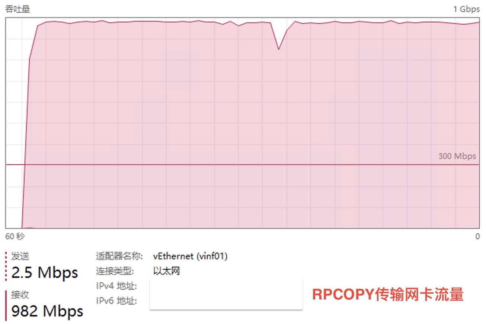
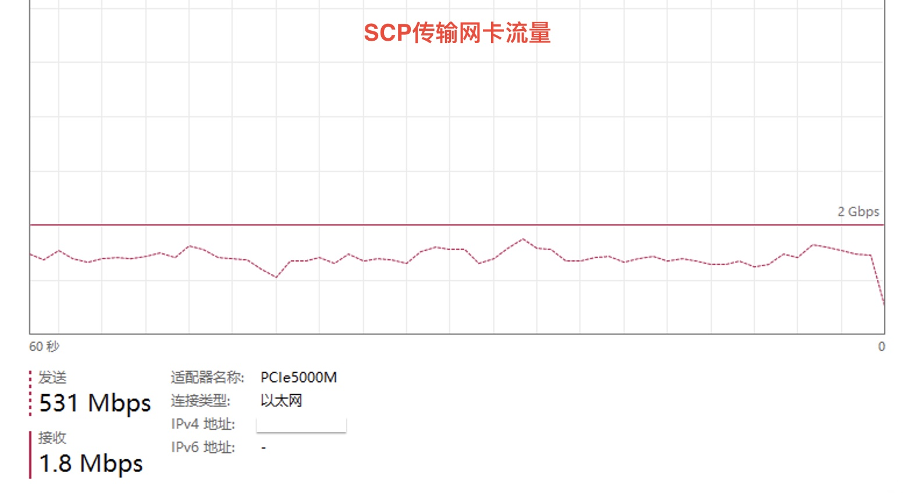

# rpcopy

跨机器文件夹RPC复制工具,支持 TLS 安全加密传输

适合通过 `RPC` 在`Windows`和`Linux`、`Mac`中批量中转文件，无需每台机器配置共享文件夹

功能类似于 `scp` （无需ssh账号），但是支持 windows、linux、mac 互传，支持筛选文件，支持压缩

`rpcopy` 会`限定目录`，远程复制过来的文件必须放在`指定根目录`下。

## Performance


| test data（Wi-Fi 5 传输） |    rpcopy     |    scp  |
|--------------------------|---------------|---------|
| 1782 个文件，共 4419 MB    |     203 秒    |  685 秒 |


| test data（5000MB有线网卡 传输） |    rpcopy     |    scp   |
|-------------------------------|---------------|----------|
| 14959 个文件，共 34.2 GB        |     134 秒    |  183 秒  |


`rpcopy` 在 `mac` 或 `Linux` 上表现要优于在 `windows`上。

上述测试，从 `windows` rpcopy 到 `mac`，需要`134秒`，从 `mac` rpcopy 到 `windows` 只需要 `96秒`





## Quick Start

1） 在 `Machine A` 上面启动 `server` 端

```Bash
./rpcopy server --target-dir=/Volumes/SSD256/logs/nn01 --host=192.168.0.33 --port=9527
#
# 服务端会将所有收到的文件保存在 --target-dir= 指定的 /Volumes/SSD256/logs/nn01 文件夹下面
# 文件夹结构与传输进来的一致
#
# --overwrite：如果服务器上已经存在了，是否允许客户端覆盖，默认为 true： 允许覆盖
```

2） 在 `Machine B` 上面使用 `客户端` send 文件夹

```Bash
./rpcopy send --source-dir=/data/hadoop/logs/nn01 --host=192.168.0.33 --port=9527
#
# 客户端会将 --source-dir= 指定的 /data/hadoop/logs/nn01 文件夹下面所有文件逐一发送到服务端（192.168.0.33:9527）去保存
# 服务器上的文件夹结构与客户端的将会一模一样
#
# --follow-symlink： 默认 false，只会复制软连接（如果服务端目标文件不存在，该软连接实质上无效），如果为 true， 则会复制链接到的整个目标文件
# --follow-symlink=false： 适合于软连接指向的都是相对路径、没有跨分区文件指向、没有外部文件夹指向；在服务器上，同路径同名称的也是软连接；
# --follow-symlink=true： 适合于软连接指向路径不确定性多，更期待于直接将文件本身保存的情况；在服务器上，同路径同名称的是实际文件， 而不是软连接；
#
# --zstd： 是否启用zstd压缩，默认为 false，对于文本类文件，启用该选项可以极大降低网络传输量，在一些带宽受限的场景收益颇高；视频等压缩率极低的文件不宜启用；
#
# 过滤文件夹下的文件，按需复制：
# --ignore-dot-file： 是否忽略点(.)开头的文件, 如： .DS_Store
# --ignore-empty-dir：是否忽略空文件夹
# --log-dir：发送文件在服务端接收的结果报告，按日期分为保存成功的（_success.log)和保存失败的（_failure.log)文件列表
#
# --ext：只拷贝指定后缀名的文件， .mp4 只拷贝 mp4 文件， .png 只拷贝 png 图片， .(mp4|txt|png)同时拷贝 mp4、txt、png三类文件
# --min-size：忽略小于该值的文件
# --max-size：忽略大于该值的文件
# --min-size-mb：以 MB 单位表示文件大小，会自动转化成 --min-size
# --max-size-mb：以 MB 单位表示文件大小，会自动转化成 --max-size
# --min-age： 增量复制，忽略最后修改时间早于该值的文件， 格式: 2023-12-03,15:09:08（注意日期与时间中间有逗号）, 表示 2023-12-03 15:09:08
# --max-age： 增量复制，忽略最后修改时间晚于该值的文件
#
#
# --with-tls 是否启用TLS加密传输，默认不启用；该参数需要合格的服务器端、客户端证书同时有效。证书放在 cert 目录下，域名用户自定义，但文件夹结构、名称不能修改。
#
```

3） TLS 加密传输

下载默认的服务端和客户端证书，`cert_files_rpcopy_com.zip`， 并将其解压在与 `rcopy` 同级目录的 `cert` 目录中，一共`5个证书`。

或者用 仓库 中 `cert/_gen_cert/gen_cert.sh` 生成自己的域名证书, 需要先修改 `gen_cert.sh` 和 `openssl.conf` 中的域名，然后再运行 `./gen_cert.sh`

服务端 只需要 `cert/server` 和 `cert/ca.crt` 3个证书；

客户端 只需要 `cert/client` 和 `cert/ca.crt` 3个证书；

然后带有 --with-tls 启动。

启动服务端

```Bash
./rpcopy server --target-dir=/Volumes/SSD256/logs/nn01 --host="files.rpcopy.com" --port=9527  --with-tls

```

在客户端需要修改 `/etc/hosts` 将域名指向你的服务端IP

```Bash
192.168.0.123   files.rpcopy.com

```

启动客户端

```Bash
./rpcopy send --source-dir=/data/hadoop/logs/nn01 --host="files.rpcopy.com" --port=9527  --with-tls

```

启用加密传输时， 两端的证书必须匹配，否则无法连接成功。

服务端的证书不应泄漏给任何人。

不同的客户端可以使用同一套客户端证书（简单），也可以为每个客户端生成不同的证书（专用）。

一般服务端证书 `cert/server` 和 `cert/ca.crt` 和域名始终不变，客户端的证书 `cert/client` 可以按需生成

如果域名发生改变，所有证书需要重新生成


